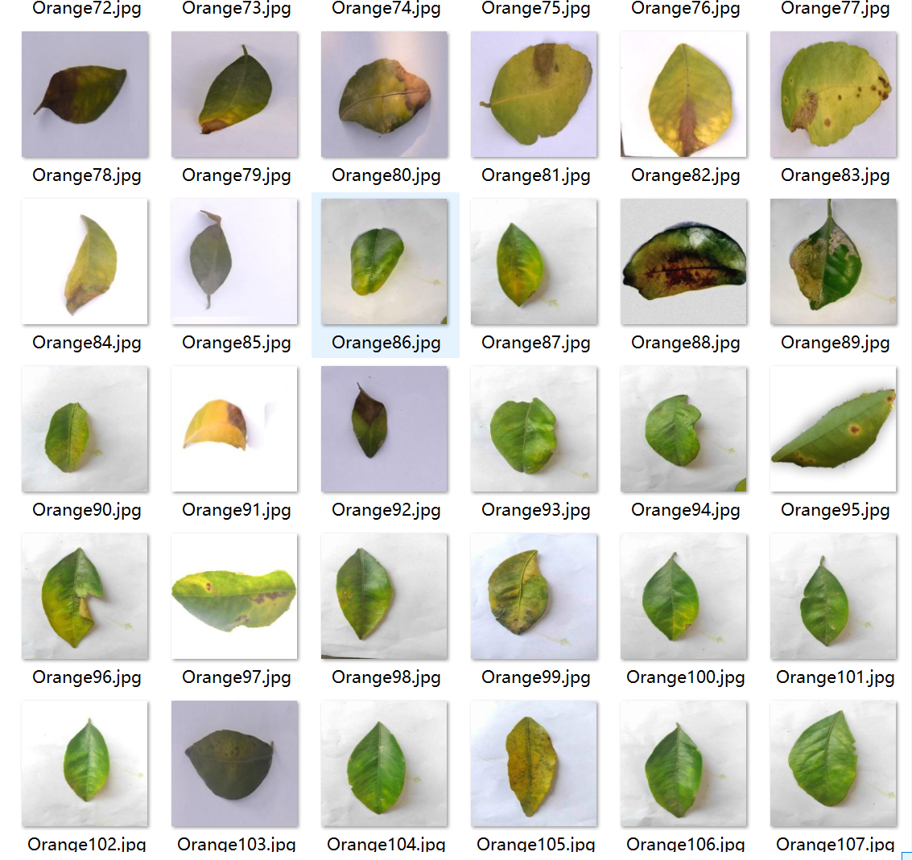
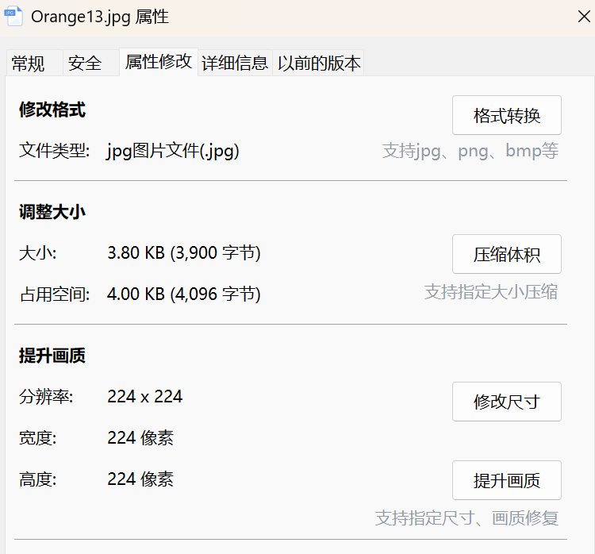
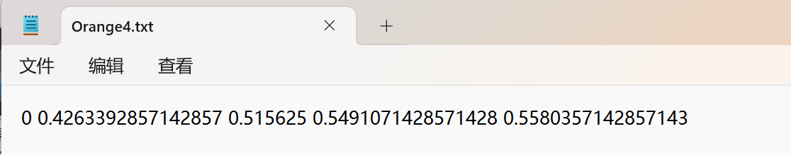
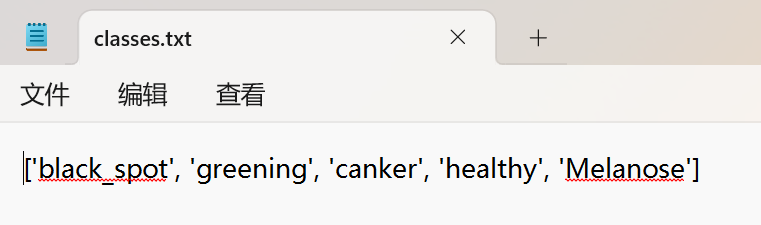
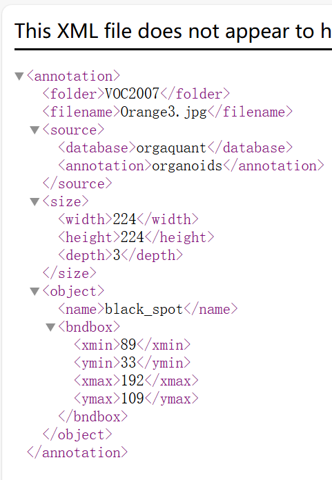
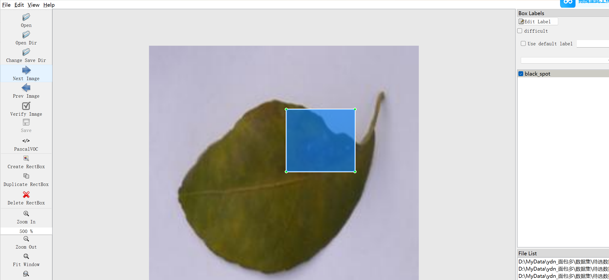

# Citrus Leaf Disease Target Detection Dataset

Dataset Information Introduction: The dataset consists of a total of 1571 images and one-to-one corresponding annotation files.
Annotation Files: There are two formats available for the annotation files, including VOC formatted xml files and YOLO formatted txt files.
Annotation Objects: The following are the annotated objects:
['black_spot', 'greening', 'canker', 'healthy', 'Melanose']
Annotation Box Count Information: (When annotating, it is usually labeled in English, and the Chinese names provided inside the brackets serve as references.)
Note: One image may be annotated with multiple objects, so the total number of annotation boxes might be greater than the number of images.
The complete dataset includes three folders and one txt file:
all_images: Stores the dataset images, screenshots included:
Image Size Information:
all_txt folder and classes.txt: Stores the yolo formatted txt annotation files, the number of annotation files is the same as the number of images, each annotation file is one-to-one corresponding.
classes.txt:
For a detailed understanding of the standard file in yolo format, please search for it yourself on Baidu. In short, the number 0 represents the name at the position 0 in the array in classes.txt.
all_xml: VOC formatted xml annotation files.
The number and images are the same, each annotation file is one-to-one corresponding.
For a detailed understanding of the standard file in VOC format, please search for it yourself on Baidu.
Both formats of annotation can be used, choose one according to your preference.
Annotation Screenshots:

## Images

Here is a pay link on Stripe ( https://buy.stripe.com/3cs8yP7sY87d0vu9AB ). Please contact me lonlonago@foxmail.com after funding $89, and I will send you a complete data files , thank you!

